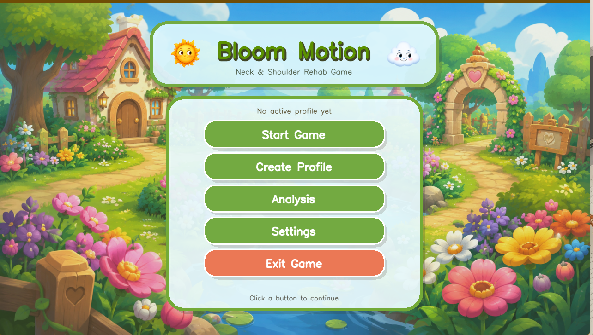
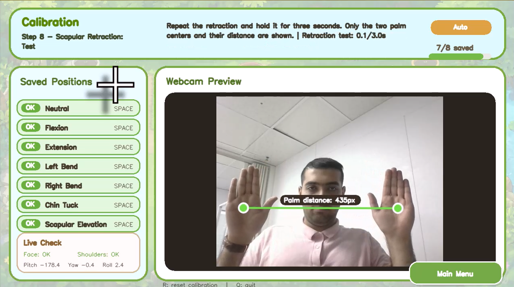
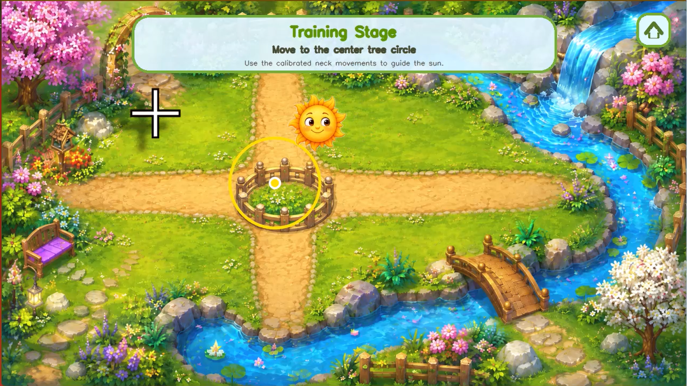

# Vision-Based Gamified Rehabilitation System

A webcam-based, sensor-free rehabilitation system for neck and scapular exercises developed using Python, OpenCV, MediaPipe, and computer vision.

The system provides personalized calibration, real-time markerless movement tracking, exercise feedback, and gamified rehabilitation tasks using a standard webcam.

## Project Preview

### Main Menu

### Personalized Calibration

### Gamified Training

## Key Features

- Webcam-based and sensor-free operation
- Personalized movement calibration
- Real-time face, head, upper-body, and hand tracking
- Neck flexion and extension exercises
- Left and right lateral neck bending
- Chin tuck exercise
- Scapular elevation
- Scapular retraction
- Real-time exercise feedback
- Progress tracking and analysis

## Technologies

- Python
- OpenCV
- MediaPipe
- Computer Vision
- Real-Time Image Processing

## Source Code Availability

The complete source code is not publicly distributed.

This repository is intended to provide an academic and technical overview of the project for research and portfolio purposes.

© 2026 Mohammadreza Akhbari. All rights reserved.
